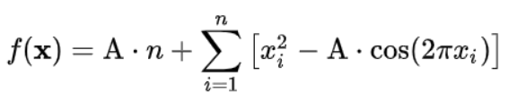
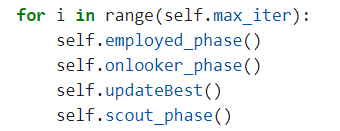
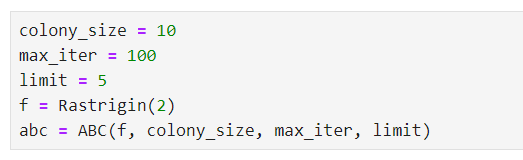

# artificial_bee_colony
Implementation of the Artificial Bee Colony algorithm for n-dimensional function maximization.
**artificial_bee_colony**

**1. Objective Function :**

We implement the Artificial Bee Colony algorithm for n-dimensional function maximization.

First I need to define what my objective function is : min <= x1, ...., xdim <= max : 

**2. Example Rastrigin function :**

The Rastrigin function is a mathematical function often used to evaluate the performance of optimization algorithms. It presents some interesting pitfalls, in the form of its many local minima and maxima. 

**Its definition, in dimension n, is :**

**Where A = 10 and -5.12 <= xi <= 5.12**

**Implementation :**

**3. Implement ABC Algorithm :**

There are several ways to implement the algorithm, for example we can define each bee class, but given that some bees repeat common steps, we decided to implement a FoodSource class which does not correspond to a single bee source. food but has a total solution of dimension equal to that of the objective function.

**Food Source Class**

**Where :**

- The source is an array randomly assign, its size **is equal to the dimension of the objective function goal\_fun**.
- eval is equal to goal\_fun(source)
- fit is equal to fit(eval) = fit(goal\_fun(source), where **fit(f) is 1/(1+f) if f > 0 else 1 + abs(f)**
- And trial is initialized to 0

Given that employed bee and onlooker bee update in the same way with only one difference (onlooker bee uses probabilities). We decided to directly implement this update function directly in Food Source. **This function updates in function of greedy selection the current Food Source from a partner Food Source :**

- **Explaination of this function :**
- **We generate a new food source location :** 
  - random r  between -1 and 1
  - We select a random index between 0 and len(self.source) (exclude)
  - x = self.source[index]
  - x\_partner = partner.source[index]
  - **new\_xi = x + r(x-x\_partner) = 2.4467, x\_new need to respect the constraints ! \***
- **New food source location : new\_source = [source[0] ... source[index] = new\_xi, .......]**
- **Compute f(new\_source) = goal\_fun(new\_source) and new\_fitness = fit(new\_eval)** 
- **Apply greedy selection:**
  - If new\_fitness < self.fitness:
    - It means that we found a better solution so the food source is updated to the new one !
    - We update the current Food Source with its new\_fitness, new\_eval, new source and we **reset trial to 0.**
  - Else we change nothing but we increment **self.trial by one.**
- **(\*) : If new\_xi doesn't respect the constraints, there are many ways to pass this issue:**
  - You can create a will loop which stop when x\_new is good, but this is not the best solution if we look to time complexity.
  - Else, it is current to put x\_new to the max value of the objective function if it is greater or to put x\_new to the minimum if it is less. But if you run many iterations, this will increase the chance that each value of each food source it is equal to an extreme value.
  - So in our code we decided, if x\_new doesn't respect the constraints :!
  - **It allows us to be close to extreme values, but skip flat areas instead of the second option.**

As said previously, this function will be used by employed bees and onlooker bees. So, for scout bees we will use a different function :

We use the same principle that when we create a new Food Source, we just simply generate a random source array.

**ABC Class**

Now, we can implement the final class. This class **computes all the algorithm**. Its attributs are:

- goal\_fun which is the objective function
- colony\_size which is the number of Food Source we will generate, more we increase it more the algorithm is efficient but we increase space complexity and time complexity too.
- limit is the max trial which can reach each Food Source.
- sources is an array of Food Source and of size equals to colony size, like said previously these Food Sources are generate randomly.
- best\_solution allows us to save during the algorithm the best goal\_fun value, and best\_answer is the values which allow us to reach this best solution.

**Employed Phase :**

**We go through all the Food Sources, and for each, we apply the function of updateLocation with a partner Food Source, selected randomly and different from the current one. This is abstract, the Food Sources are here rather the employed bees.**

**Onlooker Phase :**

- **First we compute the probabilities of each Food Source :  p(Xi) = fit(Xi)/Sum(fit)**
- **We need to make colony\_size of update,  we consider that we made an update if r is smaller than the probabilitie and apply updateLocation even if greedy selection don't chose the new Food Source.**
- **So we create a loop for this and increase n\_update if we made an update.** 
- **For each step of this loop, we generate a random number r, if r < probabilitie of the current Food Source we apply to it updateLocation with a random partner.**

**Scout Phase :**

\
**During this phase we forced to update randomly Food Source with a trial >= limit.** 

**All Algorithm :**

- **In abc.optimize(), we make max\_iter iterations and we apply each previous phases.**
- **We also need to save the best solution before scout phase, because this phase can replace good solutions with less good ones. We use udpateBest() function :**

**At the end we return the best answer to the objective function with the best solution ever find. In the code, we have added different parameters to display some information of the algorithm during its uses.**

**Test of ABC on Rastrigin function :**

 

We create a new abc instance for this :

**The ABC works well, we find a better solution of the potential value to approach ! (Best one is currently approaching 80.706).**

**Convergence :**

**We can see for the same function, ABC converge very quickly to a good fitness value. ABC works well for this function which has many local maxima traps. Because thanks to the scout phase, it allows you to escape from these traps by resetting the food sources.**

